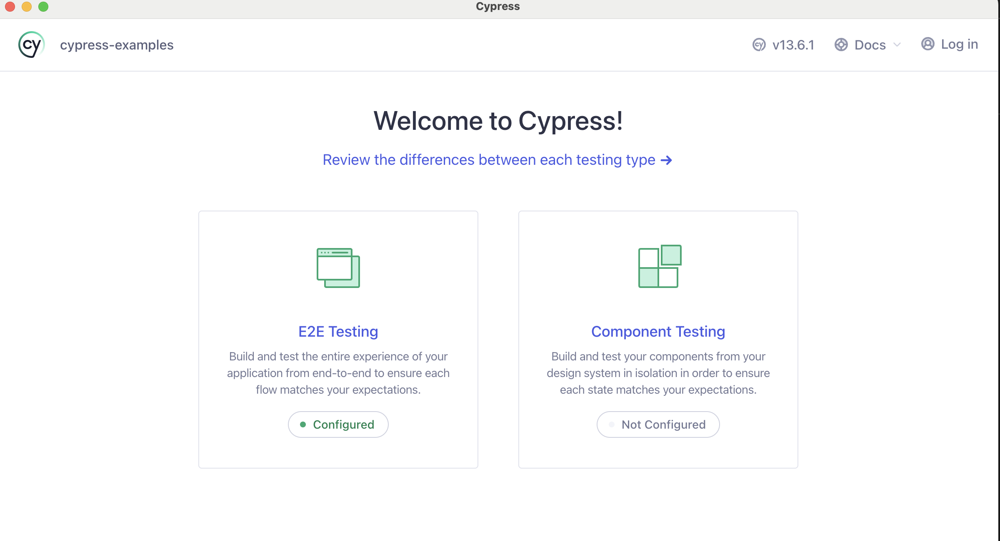
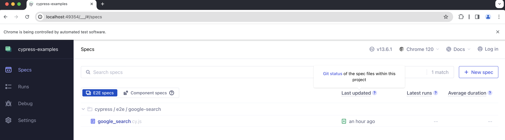

# Installation

1. Clone the repository `git clone git@github.com:falessa/cypress-examples.git`
2. Install the dependencies by running `npm install` in the project's root directory

# Run the tests
1. `npx cypress open` and select "E2E Testing" when the following opens.

2. Choose Chrome and click on "Start E2E Testing in Chrome"

3. A new Chrome window will be opened containing the test files. Click on any *.cy.js file to run the tests

4. ENJOY! ❤️